\decimalpoint

# Ejercicio sobre gradiente descendente

Este ejercicio se desarrolla en el script `p1_iterativa.py`. En él se pretende estudiar la búsqueda iterativa de óptimos de funciones, principalmente mediante el algoritmo de gradiente descendente.

## Apartado 1

En la función `gd` se implementa el algoritmo de gradiente descendente. Se ha sobrecargado ligeramente para devolver una evolución del punto elegido a lo largo de las iteraciones, que será útil en apartados posteriores.

Destacamos que es posible usar dos criterios de parada: un número máximo de iteraciones, y un valor umbral por debajo del cual se considera que se ha alcanzado el mínimo (relevante cuando la función sea no negativa y el mínimo buscado sea 0).

## Apartado 2

La función considerada en este apartado es $E(u, v) = (ue^v - 2ve^{-u})^2$, que es derivable. Le aplicamos el algoritmo de gradiente descendente para encontrar un mínimo local, partiendo del punto inicial $(1, 1)$ y con una tasa de aprendizaje $\eta = 0.1$:

```python
# Ejecutamos el algoritmo de gradiente descendente
w = np.array([1.0, 1.0], dtype = np.float64)
wmin, it, _ = gd(E, dE, w, lr = 0.1, max_it = np.inf, eps = 1e-14)
```

La expresión analítica del gradiente de la función $E$ es:
$$\nabla E(u, v) = \left( \frac{\partial E}{\partial u}(u,v), \frac{\partial E}{\partial v}(u, v) \right)^T = $$
$$=(2(ue^v-2ve^{-u}) (e^v + 2ve^{-u}), \ 2(ue^v-2ve^{-u}) (u e^v - 2e^{-u}))^T.$$

Observamos que en la ejecución hemos usado el criterio de parada relacionado con el umbral, que establecemos a $10^{-14}$. Notamos que se tardan **10 iteraciones** en alcanzar un valor por debajo de dicho umbral, y concretamente se alcanza por primera vez en las coordenadas $(u, v) = (0.04473, 0.02395)$. Como la función $E$ es no negativa, el mínimo valor que podría tomar es el $0$, y de hecho lo alcanza en $(0, 0)$. Podemos asegurar entonces que $E$ tiene un mínimo local (y global) en el punto $(0.04473, 0.02395)$.

## Apartado 3

Consideramos ahora la función $f(x, y) = (x-2)^2 + 2(y+2)^2 + 2\sin(2\pi x)\sin(2 \pi y)$, que es derivable, y cuyo gradiente es:
$$\nabla f(x, y) = \left( \frac{\partial f}{\partial x}(x,y), \frac{\partial f}{\partial y}(x, y) \right)^T = $$
$$=(2(x-2) + 4\pi\cos(2 \pi x)\sin(2 \pi y), \ 4(y + 2) + 4\pi\sin(2 \pi x)\cos(2 \pi y))^T.$$

Le aplicamos el algoritmo de gradiente descendente durante 50 iteraciones, partiendo del punto inicial $(1, -1)$, y con una tasa de aprendizaje de $\eta = 0.01$:

```python
# Ejecutamos el algoritmo de gradiente descendente
w = np.array([1.0, -1.0])
wmin, _, evol = gd(f, df, w, lr = 0.01, max_it = 50)
```

Obtenemos que el valor mínimo que se ha encontrado es $-0.38124$, alcanzándose en el punto $(1.26906, -1.28672)$. Si repetimos el cálculo con una tasa de aprendizaje $\eta = 0.1$, obtenemos un valor mínimo de $0.53438$ en el punto $(2.85379, -1.98039)$.

Como hemos guardado la evolución que ha sufrido el punto inicial hasta llegar al punto final, podemos representar en una gráfica la evolución del valor de la función a lo largo de las iteraciones:

```python
# Mostramos la gráfica de la evolución del valor de f
plt.plot(range(max_it + 1), [f(*w) for w in evol],
    'o', label = r"$\eta$ = " + str(lr), linestyle = '--')
```

Dibujando en una misma gráfica la evolución para las distintas tasas de aprendizaje usadas, obtenemos lo siguiente:

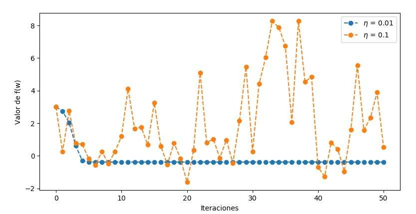{width=450px}

Podemos ver que en el caso $\eta = 0.01$ el algoritmo converge a gran velocidad, necesitando menos de 10 iteraciones para estabilizarse en el valor del mínimo. Sin embargo, con una tasa de aprendizaje 10 veces mayor se producen oscilaciones muy pronunciadas, haciendo que no se alcance la convergencia a un mínimo local. Esto es así porque, aunque estamos avanzando en la dirección y sentido de máxima pendiente, el cambio que hacemos en los pesos es demasiado grande y nos "escapamos" del mínimo.

Por otro lado, para $\eta = 0.1$ hay momentos en los que se alcanza un valor más pequeño que el alcanzado por el algoritmo con una tasa de aprendizaje menor, pero al no conseguir estabilizarse lo perdemos rápidamente. De hecho en la iteración 50 hemos tenido suerte y ha parado en un valor relativamente pequeño (aunque más grande que su equivalente con $\eta = 0.01$), pero si lo dejásemos continuar es probable que siguiera oscilando indefinidamente.

Se observa entonces una fuerte dependencia entre la convergencia del algoritmo y la tasa de aprendizaje elegida. Veamos ahora cómo afecta la elección del punto inicial. Para ello, ejecutamos el algoritmo durante $50$ iteraciones, con una tasa de aprendizaje fija de $0.01$, y variando el punto inicial. Obtenemos la siguiente tabla:

Punto inicial  Punto mínimo             Valor del mínimo
-------------- ------------------------ --------------------
$(2.1, -2.1)$    $(2.24380, -2.23793)$    -1.82008
$(3, -3)$        $(2.73094, -2.71328)$    -0.38125
$(1.5, 1.5)$     $(1.77792, 1.03206)$     18.04208
$(1, -1)$        $(1.26906, -1.28672)$    -0.38125

Vemos que dependiendo del punto inicial elegido el valor del mínimo encontrado cambia bastante, siendo el más bajo el asociado al punto inicial $(2.1, -2.1)$. Destacamos el caso del punto $(1.5, 1.5)$, en el que el valor del mínimo está muy lejos de ser óptimo. Esta función tiene la particularidad de que en un entorno de los puntos iniciales elegidos tiene muchos mínimos locales, como podemos apreciar en la siguiente representación (hecha con la función `surface_plot`).

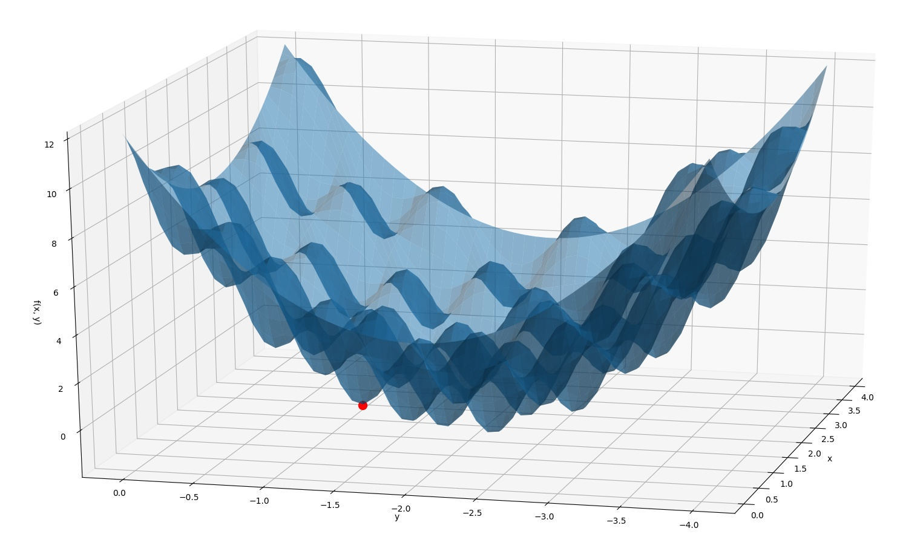{width=450px}

Está claro entonces que dependiendo del punto de partida, el vector evolucionará hasta el mínimo local más cercano, que puede no ser global. Podemos comprobar para un caso particular que el punto encontrado es efectivamente un mínimo local, observando el diagrama de contorno de $f$ y el mínimo encontrado destacado en rojo (realizado con la función  `contour_plot`). Hemos elegido como punto inicial el $(1, -1)$.

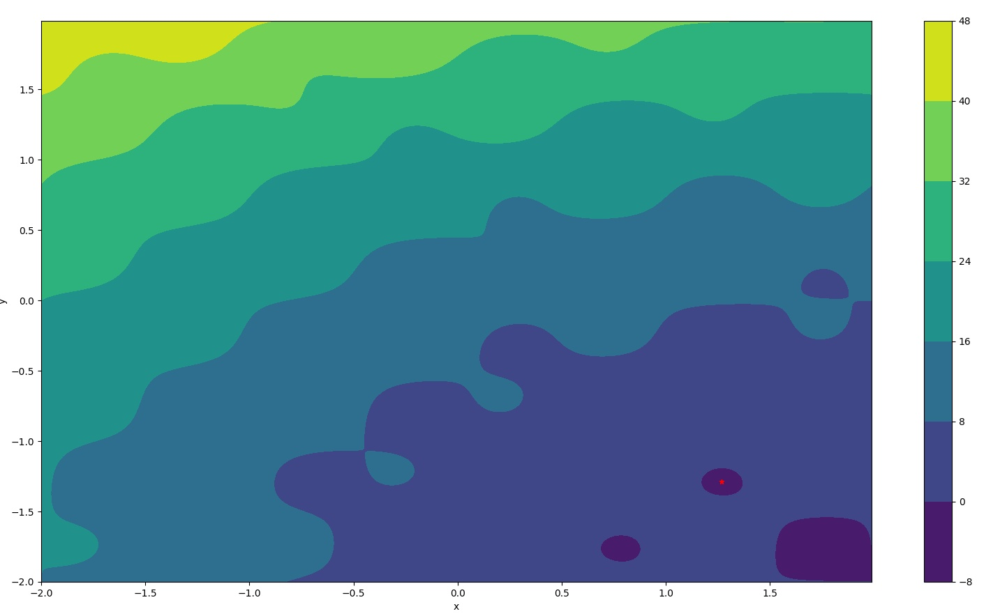{width=430px}

Habiendo realizado estas pruebas, podemos decir que la verdadera dificultad a la hora de encontrar el mínimo de una función arbitraria es **ajustar los parámetros del algoritmo de optimización**. En nuestro caso, suponiendo que la función es derivable y podemos aplicar el algoritmo de gradiente descendente, debemos tener en cuenta la forma de la función. Si esta no es convexa (la mayoría de veces no lo será), los mínimos locales no serán en general mínimos globales. Debemos prestar especial atención a

- **la tasa de aprendizaje**. Si la elegimos demasiado pequeña, la velocidad de convergencia será muy lenta y necesitaremos muchas iteraciones para converger. Además, si caemos en un óptimo local seguramente no podremos salir de él, pues los movimientos realizados serán demasiado pequeños. Sin embargo, si la elegimos demasiado grande nos arriesgamos a que se produzcan fuertes oscilaciones que hagan que nunca lleguemos a converger a un mínimo local. Una posible solución es usar una tasa de aprendizaje *adaptable*: que sea grande al principio y que vaya disminuyendo conforme avanzan las iteraciones.

- **el punto inicial**. Podemos caer fácilmente en óptimos locales que estén lejos de ser óptimos globales si el punto inicial del algoritmo no es bueno. Este riesgo aumenta cuantos más mínimos locales tenga la función que estamos optimizando.

En la práctica no siempre podremos visualizar las funciones que queramos minimizar y elegir los parámetros en consecuencia, por lo que tendremos que experimentar con distintos valores hasta encontrar los más adecuados.

\newpage

# Ejercicio sobre regresión lineal

Este ejercicio se desarrolla en el script `p1_regresion.py`. En él perseguimos ajustar distintos modelos de regresión lineal y utilizarlos posteriormente para realizar una clasificación binaria de etiquetas. Por tanto, nuestra clase de funciones candidatas, para vectores de características $x = (1, x_1, \dots, x_d)^T$, es:
$$\mathcal{H} = \{ h:\mathbb{R}^{d+1} \to \mathbb{R} \ | \ h(x) = w^Tx, \ w \in \mathbb{R}^{d+1} \}.$$

## Apartado 1

En este caso vamos a ajustar modelos de regresión lineal a vectores de características extraídos de dígitos manuscritos. En particular se extraen dos características: la intensidad media y la simetría respecto al eje vertical. Para simplificar el problema, consideramos únicamente las imágenes correspondientes a los dígitos $1$ y $5$.

Disponemos de una función `read_data` para leer los datos de fichero. Una vez los tenemos, organizamos el dato $i$-ésimo en un vector de características $x_i = (1, x_{n1}, x_{n2})^T$, que ya tiene el término de *bias* añadido, y consideramos la matriz $X = (x_n^T)_{n=1}^N$. Tenemos también un vector $y$ de etiquetas de longitud $N$, que son $-1$ ó $1$ según si el ejemplo pertenece al dígito $1$ ó $5$.

### Gradiente descendente estocástico

El algoritmo de gradiente descendente estocástico (*SGD, stochastic gradient descent*) es muy similar al de gradiente descendente del ejercicio anterior. La diferencia es que al actualizar el vector de pesos considera en cada iteración únicamente un subconjunto de los datos, elegido aleatoriamente del total. Cuando se han elegido todos los datos posibles, se baraja el conjunto y se vuelve a dividir en trozos o *batches*. La implementación completa se puede ver en la función `sgd`.

Ejecutamos el algoritmo con un *batch size* de 64, una tasa de aprendizaje de $0.1$ y 100 iteraciones. Obtenemos un vector de pesos $w_{\text{sgd}} = (-1.24530, -0.17810, -0.43646)^T$.

```python
# Ejecutamos el algoritmo SGD
w_sgd = sgd(X_train, y_train, 0.1, 64, 100)
```

### Método de la pseudoinversa

En este caso resolvemos el problema de mínimos cuadrados que surge al tratar de encontrar un vector $w$ que minimice el error cuadrático medio entre las predicciones y las etiquetas reales, a saber:
$$E_{in}(w) = \frac{1}{N} \sum_{n=1}^N (w^Tx_n - y_n)^2.$$

Sabemos que la expresión analítica de la solución es $w=X^{+}y$, donde $X^{+} = (X^TX)^{-1}X^T$ se conoce como *pseudoinversa* de la matriz $X$. En vez de hacer directamente esta cuenta, intentamos evitar el (potencialmente muy costoso) cálculo de una matriz inversa, utilizando en su lugar la [descomposición SVD](https://en.wikipedia.org/wiki/Singular_value_decomposition) de la matriz $X$. Sabemos que si $X$ tiene dimensiones $N \times (d+1)$ podemos escribir $X = U\Sigma V^T$, donde $U$ es una matriz ortogonal $N \times N$, $\Sigma$ una matriz diagonal rectangular $N \times (d+1)$, y $V$ una matriz ortogonal $(d+1)\times (d+1)$. Teniendo en mente que para una matriz ortogonal $Q$ se verifica $Q^T = Q^{-1}$, tenemos que
$$(X^TX)^{-1} = (V\Sigma^TU^TU \Sigma V^T)^{-1} = (V\Sigma^T\Sigma V^T)^{-1} = V (\Sigma^T\Sigma)^{-1} V^T.$$

Por tanto, llegamos a que
$$X^+ = (X^TX)^{-1}X^T = (V (\Sigma^T\Sigma)^{-1} V^T)(U\Sigma V^T)^T =$$
$$=V (\Sigma^T\Sigma)^{-1} V^T V \Sigma^T U^T = V(\Sigma^T\Sigma)^{-1}\Sigma^T U^T = V\Sigma^+U^T.$$

Se comprueba fácilmente que $\Sigma^+$ puede obtenerse invirtiendo los elementos no nulos de $\Sigma$ y después trasponiendo el resultado. Además, como es una matriz diagonal rectangular, para hacer los cálculos solo nos interesa el bloque $(d+1)\times (d+1)$ inicial. De esta forma obtenemos una fórmula más eficiente para resolver el problema, y es así como se implementa en la función `pseudoinverse`, que ahora debería ser auto explicativa.

Tras ejecutar el algoritmo, obtenemos los pesos  $w_{pseudo} = (-1.11588, -1.24860, -0.49753)^T$.

```python
# Ejecutamos el algoritmo de la pseudoinversa
w_pseudo = pseudoinverse(X_train, y_train)
```

Pasamos finalmente a comparar los ajustes de los dos modelos (SGD y pseudoinversa). En primer lugar podemos visualizar los modelos obtenidos, teniendo en cuenta que vienen dados por la recta $w^Tx = 0$ en $\mathbb{R}^2$, y que nuestra intención es que separen bien por clases los datos de nuestro conjunto de entrenamiento. Lo hacemos mediante la función `scatter_plot`.

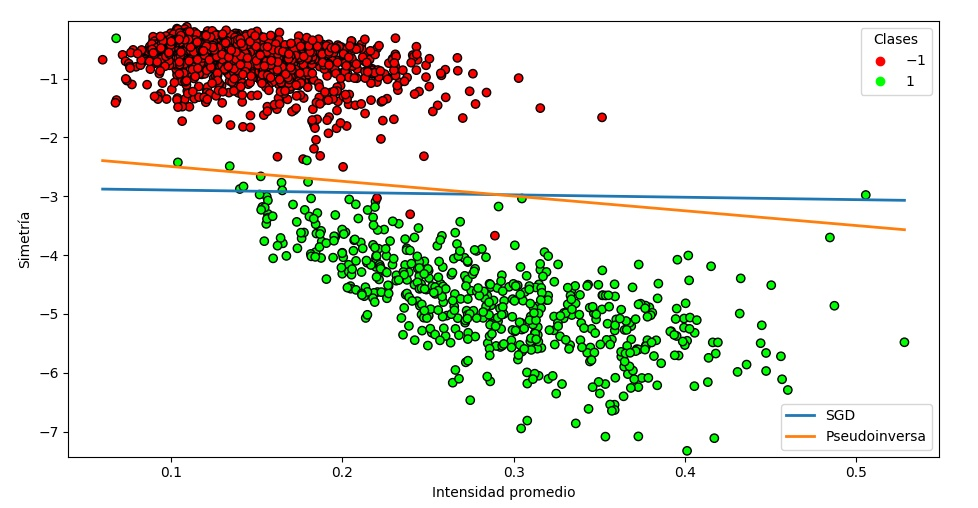{width=450px}

Para estudiar la bondad de los modelos, calculamos tanto el error *in-sample* como el error *out-sample*. La función de error considerada es el ya mencionado error cuadrático medio, cuyo cálculo se implementa en la función `err`:
$$E_{in}(w) = \frac{1}{N} \sum_{n=1}^N (w^Tx_n - y_n)^2.$$

Para el error $E_{out}$ aplicamos la misma fórmula, pero con los datos de test de los que disponemos. Se trata de medir cómo de buenas son las predicciones de los modelos con datos que no se han visto antes. Obtenemos la siguiente tabla:

Método         $E_{in}$   $E_{out}$
-------------- ---------- --------------------
SGD            0.08612    0.13304
Pseudoinversa  0.07918    0.13095

Vemos cómo los errores son similares en ambos casos, siendo el de la pseudoinversa ligeramente menor. Respecto a la diferencia entre $E_{in}$ y $E_{out}$ dentro de cada método, es normal que el segundo sea mayor, pues al generalizar a puntos que no conocemos cometemos un cierto error. De hecho, sabemos que para el caso lineal la relación entre ambos es
$$E_{out} = E_{in} + \mathcal{O}\left(\frac{d}{N}\right).$$

Podemos concluir que ambos modelos realizan un buen ajuste, pues los errores son bajos y en la gráfica anterior se observa que separan bien los datos. Para estos datos el método de la pseudoinversa parece imponerse, pero en otro contexto podría ser más adecuado el método de SGD. Este último tiene un cierto grado de aleatoriedad que le permite en ocasiones escapar de óptimos locales.

## Apartado 2

En este apartado realizamos un experimento para ver cómo se comportan los errores $E_{in}$ y $E_{out}$ cuando aumentamos la complejidad del modelo de regresión.

En primer lugar, generamos 1000 puntos de entrenamiento de manera uniforme en el cuadrado $[-1, 1] \times [-1, 1]$, mediante la función `uniform_data`. A continuación les asignamos etiquetas usando la función $f(x_1, x_2) = sign((x_1 - 0.2)^2 + x_2^2 - 0.6)$, e introducimos ruido cambiando aleatoriamente el signo de un 10% de ellas. Todo esto se realiza en la función `generate_features`.

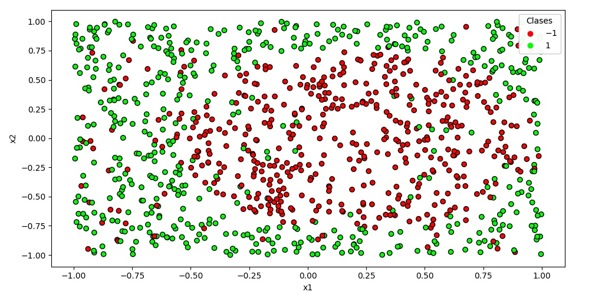{width=450px}

### Vector de características lineales

Consideramos el vector de características $(1, x_1, x_2)^T$, y ajustamos mediante SGD un modelo de regresión lineal a los datos, utilizando una tasa de aprendizaje de $0.1$ y un tamaño de *batch* de $64$. Generamos además otro lote de 1000 puntos que sirvan como datos de test para aproximar el error de generalización $E_{out}$. La función `experiment` resume este proceso, teniendo el cuenta que el argumento `is_linear = True` le dice que el vector de características a usar es el que hemos mencionado.

```python
# Generamos datos de entrenamiento y de test
X, y = generate_features(1000, is_linear = True)
X_test, y_test = generate_features(1000, is_linear = True)
# Ajustamos un modelo de regresión lineal mediante SGD
w = sgd(X, y, lr, 64, 100)
# Calculamos los errores
ein = err(w, X, y)
eout = err(w, X_test, y_test)
```

Para este modelo obtenemos un vector de pesos $w=(0.07916, -0.47272, 0.07906)^T$ y unos errores $E_{in} = 0.92211$ y
$E_{out} = 0.94471$, que son bastante altos. Esto no es de extrañar, pues observando el mapa de etiquetas salta a la vista que ninguna recta podrá separar los datos por clases. Si repetimos 1000 veces este experimento y hacemos la media de los errores obtenemos algo bastante parecido:
$$E_{in} = 0.92872, \quad E_{out} = 0.93474.$$

Vemos como ya esperábamos que ambos errores son similares. La conclusión es que con el vector de características empleado no conseguimos ajustar un modelo que separe las clases.

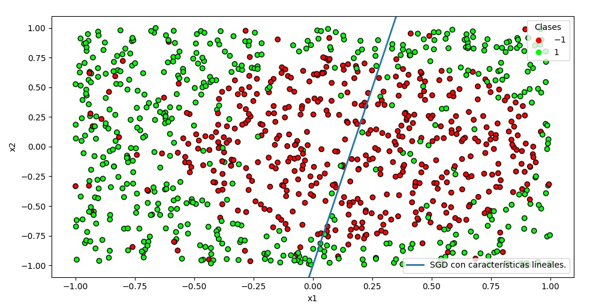{width=450px}

### Vector de características no lineales

Repetimos todo el experimento anterior, pero considerando ahora como vector de características $(1, x_1, x_2, x_1x_2, x_1^2, x_2^2)^T$, de forma que el vector de pesos será un vector en $\mathbb{R}^6$. En este caso, aunque el modelo sigue siendo lineal en los pesos, estamos ajustando **una cónica** en el plano, en lugar de una recta. Seguimos visualizándola como $w^Tx =0$.

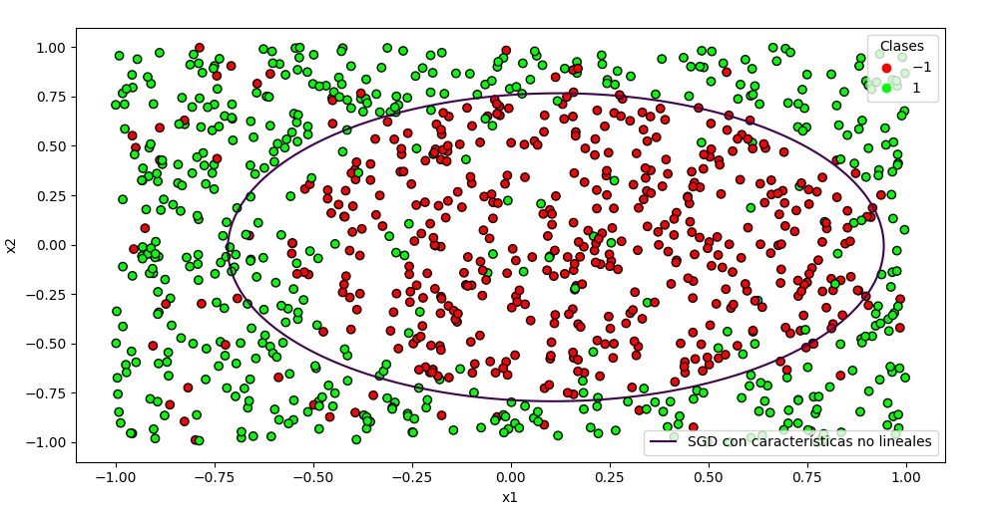{width=450px}

En una ejecución concreta de este experimento modificado (con el parámetro `is_linear = False` y un valor $\eta = 0.3$ para SGD) obtenemos un vector de pesos dado por $w=(-0.89976, -0.30522, 0.04253, -0.02479, 1.33166, 1.51043)^T$ y unos errores $E_{in} = 0.58377$ y $E_{out} = 0.62346$. Repitiendo 1000 veces el experimento con este nuevo vector de características, obtenemos unos errores medios de:
$$E_{in} = 0.58687, \quad E_{out} = 0.59316.$$

Si miramos la representación de la curva ajustada vemos que, salvo por los puntos de ruido, consigue separar más o menos bien las dos clases. Esto se refleja en que los errores son más bajos que en el modelo anterior, si bien no consigue bajar todo lo que desearíamos debido como ya hemos dicho al ruido existente en las etiquetas.

Una vez realizados estos dos experimentos, podemos concluir que al aumentar la complejidad del modelo y permitir más grados de libertad en el ajuste **podemos reducir los errores** tanto *in-sample* como *out-sample*. Al introducir términos cuadráticos en el vector de características $(1, x_1, x_2, x_1x_2, x_1^2, x_2^2)^T$ estamos permitiendo que el ajuste se asimile a la función real utilizada para etiquetar, haciendo así que los errores disminuyan (a costa de aumentar la dimensión del vector de pesos). Es por esto que este último modelo es más adecuado para ajustar nuestros datos.

# Ejercicio sobre el método de Newton (bonus)

En este ejercicio programamos el método de optimización de Newton para minimizar una función, desarrollado en el script `p1_newton.py`. Recordamos que el método de Newton aplicado a una función $f:\mathbb{R}^n \to \mathbb{R}$ se utiliza para hallar sus ceros. Nuestro objetivo es entonces anular la función $\nabla f$ con este método, llegando así a la fórmula de actualización de pesos en función de las iteraciones:
$$w_{n+1} = w_{n} - H^{-1}(w_{n})\nabla f(w_{n}),$$

donde $H$ es la matriz Hessiana de $f$, es decir,
$$H= \begin{pmatrix}
  \dfrac{\partial^2 f}{\partial x^2} & \dfrac{\partial^2 f}{\partial x \partial y} \\
  \dfrac{\partial^2 f}{\partial y \partial x} & \dfrac{\partial^2 f}{\partial y^2}
 \end{pmatrix}.$$

 La implementación de este método es muy similar a la del gradiente descendente, y puede consultarse en la función `newton`. Añadimos también un parámetro de *learning rate* $0 < \eta < 1$, convirtiéndolo en un método *relajado*.

 Para aplicarlo a la función del primer ejercicio,
 $$f(x, y) = (x-2)^2 + 2(y+2)^2 + 2\sin(2\pi x)\sin(2 \pi y),$$

 debemos definir su matriz Hessiana, que es
 $$H= \begin{pmatrix}
 2- 8 \pi^2 \sin(2 \pi y) \sin(2 \pi x) & 8 \pi^2 \cos(2 \pi x) \cos(2 \pi y)\\
  8 \pi^2 \cos(2 \pi x) \cos(2 \pi y) & 4- 8 \pi^2 \sin(2 \pi x) \sin(2 \pi y)
 \end{pmatrix}.$$

Ejecutamos el algoritmo con $\eta = 0.1$ y $\eta = 1$, para los mismos puntos iniciales que en el apartado 3 del primer ejercicio y durante 50 iteraciones.

```python
# Fijamos los parámetros
max_it = 50
w_lst = [np.array([2.1, -2.1]),
     np.array([3.0, -3.0]),
     np.array([1.5, 1.5]),
     np.array([1.0, -1.0])]
# Ejecutamos el algoritmo
for lr in [0.1, 1]:
    for w in w_lst:
        wmin, evol = newton(f, df, hf, w, lr, max_it)
```

Obtenemos las siguientes tablas de resultados:

$\eta$  Punto inicial  Punto final              Valor de $f$
------- -------------- ------------------------ --------------------
0.1     $(2.1, -2.1)$    $(2.00034, -2.00035)$    -0.00001
0.1     $(3, -3)$        $(3.05367, -3.02829)$    3.10798
0.1     $(1.5, 1.5)$     $(1.42530, 1.36855)$     23.68963
0.1     $(1, -1)$        $(0.94632, -0.97170)$    3.10798

$\eta$  Punto inicial  Punto final              Valor de $f$
------- -------------- ------------------------ --------------------
1       $(2.1, -2.1)$    $(1.75619, -1.76207)$    -1.82008
1       $(3, -3)$        $(3.05397, -3.02846)$    3.10798
1       $(1.5, 1.5)$     $(1.70483, 0.97317)$     18.08874
1       $(1, -1)$        $(0.94602, -0.97153)$    3.10798

Vemos que los valores encontrados no son muy buenos en casi ningún caso. Si comparamos con la tabla obtenida por el algoritmo de gradiente descendente en el primer ejercicio, vemos que en ningún momento se mejoran los resultados, siendo igualados únicamente en el punto $(2.1, -2.1)$ cuando usamos $\eta = 1$. Como nota, también hemos probado a ejecutar el algoritmo con $\eta = 0.01$, pero los resultados son aún peores.

Podemos generar un gráfico para ver cómo evoluciona el valor de la función con las iteraciones. Para poder visualizarlo bien escogemos algunos puntos en los que el valor de la función sea similar, como son $(2.1, -2.1)$ y $(1, -1)$.

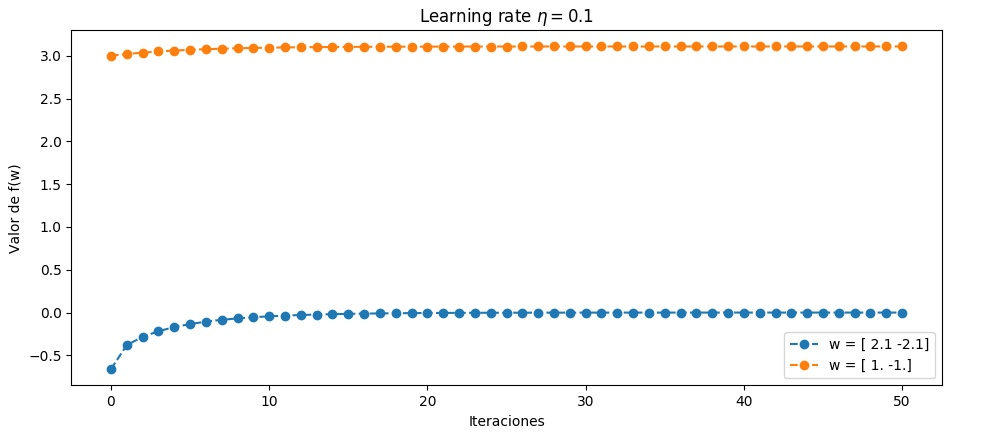{width=450px}

En este caso vemos como, de hecho, aumenta el valor de la función con respecto al punto inicial. Esto es porque como únicamente estamos haciendo $0$ el gradiente de $f$, podemos caer tanto en un mínimo local, como en un máximo local o un punto de silla.

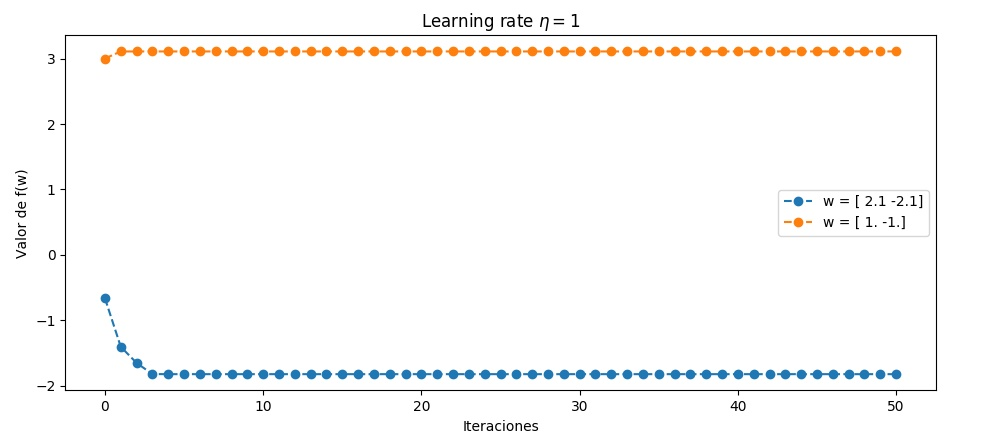{width=450px}

Al aumentar la tasa de aprendizaje, para el punto $(2.1, -2.1)$ ya sí conseguimos encontrar un mínimo local. En general observamos también que la convergencia es bastante rápida, cosa que es una de las bondades de este método. Además, no se producen muchas oscilaciones aun teniendo una tasa de aprendizaje alta. De hecho, parece que el algoritmo funciona mejor con una tasa de aprendizaje más bien elevada en la mayoría de los casos.

Podemos comparar del mismo modo la evolución del valor de la función con este método y con el de gradiente descendente, por ejemplo para el punto $(1.5, 1.5)$. En este caso hemos utilizado $\eta = 0.01$ en el caso de gradiente descendente y $\eta = 0.1$ en el método de Newton.

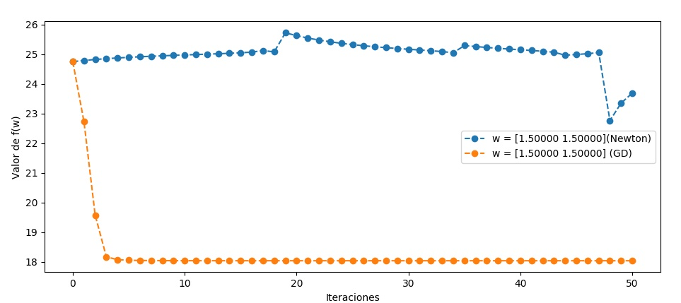{width=450px}

Como ya adivinábamos, el desempeño en el caso de gradiente descendente es mucho mejor. Mostramos por último un gráfico comparativo de todos los puntos, para el mismo valor de $\eta = 0.01$, en el que se sigue apreciando la tendencia anunciada de que el método de Newton funciona peor.

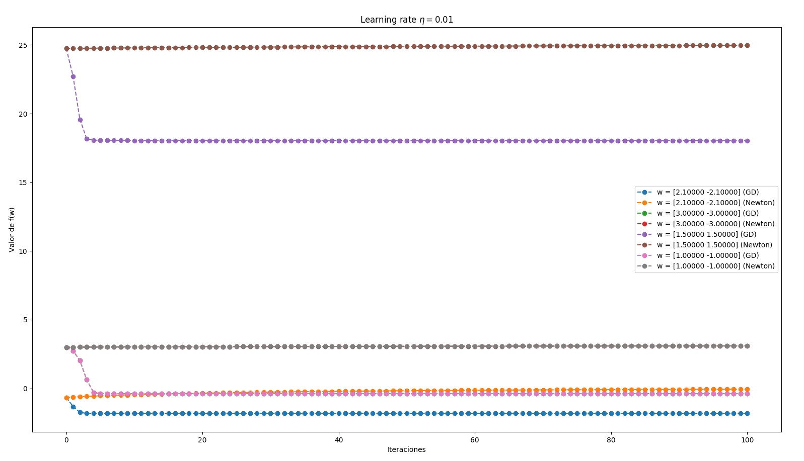{width=450px}

Como conclusión, este método parece tener un peor desempeño que el de gradiente descendente para esta función. No solo tiene unas condiciones más restrictivas para su aplicación (la función debe ser dos veces derivable), sino que también tiene un mayor coste computacional (hay que calcular una inversa) y puede caer fácilmente en máximos locales o puntos de silla. Es posible que para otras funciones con menos puntos críticos se comporte mejor.
